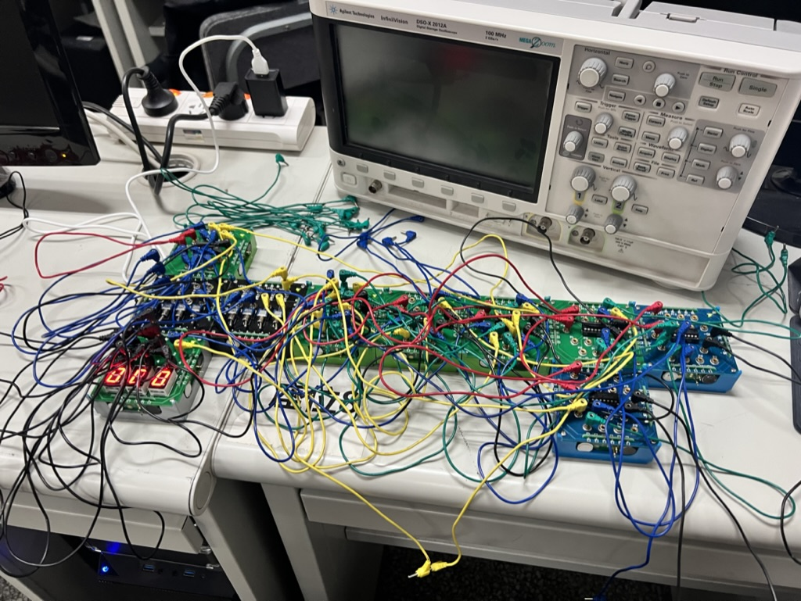
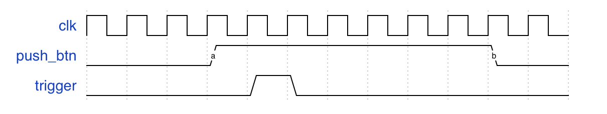
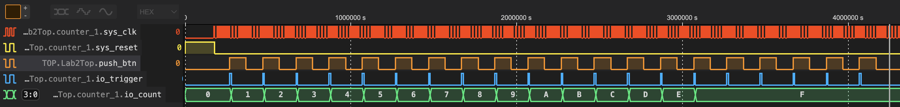

本文假设你对数字逻辑电路的基本知识有一定的了解，例如正在或已经选修《数字逻辑电路》或《数字逻辑设计》课程，了解组合逻辑与时序逻辑的区别。如果你正在选修《数字逻辑设计》课程，还是挺建议学一学 SpinalHDL 的，可以极大提升你的数设生活体验。

如果你已经或者正在选修《数字逻辑实验》《计算机组成原理》等课程，你很可能会使用 VHDL 或者 SystemVerilog 语言进行硬件描述，并通过 Quartus 或 Vivado 等 EDA (Electronic Design Automation, 电子设计自动化) 工具进行硬件设计的综合。

然而，EDA 工具自带的编辑器往往难以使用，且缺乏现代 IDE 具有的自动补全、引用跳转、语法检查等功能。通过 VS Code 等编辑器的插件能够部分弥补上述缺陷，但在同步时序电路设计中十分关键的锁存器检查、运算数宽度检查、模块输入输出端口检查上，Vivado 等工具往往只会给出警告，而这些警告会淹没在数百个常规警告中，造成难以预料的错误。

另外，这些传统硬件描述语言的设计时间都相当早：VHDL 与 Verilog 设计于 1983 年，即使是较新的 SystemVerilog 也始于 2002 年，并且多数 EDA 工具对 SystemVerilog 的支持并不完备。这导致在编写硬件描述代码时，需要编写大量的模板代码，例如状态机。接线也是饱受诟病的一点：在《数字逻辑实验》的加法器实验中，我们需要手动把各个门电路的输入输出端口用导线连接起来，形如下图：



在 SystemVerilog 中，你同样需要做类似的事情，用一个中间信号进行中转，将一个模块的输入与另一个模块的输出连接。对于像 Wishbone 总线这样有多个信号，而且需要多处连接的地方，光是进行接线本身就已经十分痛苦了，更何况你需要进行综合后，才能在 Vivado 给出的数百个警告中发现接线时偶然的 typo——

**写错部分信号名字并不会导致综合失败，即使信号的类型都对不上！**

以下是一个 Wishbone 多路复用器的接线例子：

```verilog
// Wishbone MUX
wb_mux_3 wb_mux_3_inst (
    .clk(sys_clk),
    .rst(sys_rst),

    // Master interface
    .wbm_adr_i(wbs_adr_o),
    .wbm_dat_i(wbs_dat_o),
    .wbm_dat_o(wbs_dat_i),
    .wbm_we_i(wbs_we_o),
    .wbm_sel_i(wbs_sel_o),
    .wbm_stb_i(wbs_stb_o),
    .wbm_ack_o(wbs_ack_i),
    .wbm_err_o(),
    .wbm_rty_o(),
    .wbm_cyc_i(wbs_cyc_o),

    // Slave interface 0 (to BaseRAM controller)
    // Address range: 0x8000_0000 ~ 0x803F_FFFF
    .wbs0_addr    (32'h8000_0000),
    .wbs0_addr_msk(32'hFFC0_0000),

    .wbs0_adr_o,
    .wbs0_dat_i,
    .wbs0_dat_o,
    .wbs0_we_o,
    .wbs0_sel_o,
    .wbs0_stb_o,
    .wbs0_ack_i,
    .wbs0_err_i(0),
    .wbs0_rty_i(0),
    .wbs0_cyc_o,

    // Slave interface 1 (to ExtRAM controller)
    // Address range: 0x8040_0000 ~ 0x807F_FFFF
    .wbs1_addr    (32'h8040_0000),
    .wbs1_addr_msk(32'hFFC0_0000),

    .wbs1_adr_o,
    .wbs1_dat_i,
    .wbs1_dat_o,
    .wbs1_we_o,
    .wbs1_sel_o,
    .wbs1_stb_o,
    .wbs1_ack_i,
    .wbs1_err_i(0),
    .wbs1_rty_i(0),
    .wbs1_cyc_o,

    // Slave interface 2 (to UART controller)
    // Address range: 0x1000_0000 ~ 0x1000_FFFF
    .wbs2_addr    (32'h1000_0000),
    .wbs2_addr_msk(32'hFFFF_0000),

    .wbs2_adr_o,
    .wbs2_dat_i,
    .wbs2_dat_o,
    .wbs2_we_o,
    .wbs2_sel_o,
    .wbs2_stb_o,
    .wbs2_ack_i,
    .wbs2_err_i(0),
    .wbs2_rty_i(0),
    .wbs2_cyc_o
);
```

这里用到了一个 SystemVerilog 的小技巧，即接线端口和信号的名字如果一样，则可以省略信号名字。即便在今天，你可以利用 Copilot 快速补全这些重复代码，接线错误仍然会带来许多难以排查的问题。

现在假设你已经顺利编写了语法正确的硬件描述代码，在上板测试之前，你还有重要的一步——仿真。仿真能够快速地验证设计的正确性，更重要的是通过仿真，我们可以获得每个信号每一时刻的取值，从而快速排查问题。然而，Vivado 的仿真速度实在不敢恭维，同时还存在着添加信号需要重新仿真等等问题。在进行较小规模的开发时，也许这并不是问题，但如果你要对你的 CPU 设计进行 uCore 启动过程的仿真，这可能会消耗掉数十小时的时间，这是不可接受的。

吐槽了这么多传统硬件描述语言开发与仿真流程中的痛点，接下来我们就要介绍今天的主角——SpinalHDL 了。

> 本文中没有那么重要的话会在这种格式的引用块里出现。

## SpinalHDL

[SpinalHDL](https://spinalhdl.github.io/SpinalDoc-RTD/master/SpinalHDL/Introduction/SpinalHDL.html) 是一种更高层次的硬件描述语言，基于 Scala。本质上，SpinalHDL 只是 Scala 的一个第三方库，并不是真正意义上的一门新的语言。SpinalHDL 也并不能够直接被 EDA 工具综合，而是通过编译到 VHDL、Verilog 或 SystemVerilog 等较低层次语言的方式进行综合。这有点类似于高级程序语言编译到汇编语言，再由汇编器汇编为机器语言的过程。


## 安装

由于 SpinalHDL 只是一个 Scala 库，它的安装相当简单——使用你的包管理器添加 `spinalhdl-core` 与 `spinalhdl-lib` 作为依赖即可，前者是 SpinalHDL 的核心语言功能，后者是 SpinalHDL 提供的众多工具库。

等等，你说你还不会 Scala？没有关系！笔者同样是在学习 SpinalHDL 的过程中学习 Scala 的。考虑到计算机系的专业课中基本没有用上 Scala 的机会，本文将会逐步覆盖到 SpinalHDL 中使用到的 Scala 语法。事实上，经过计算机系的拷打，相信读者已经发现除了语言神 Rust，学习一门新编程语言的成本是很低的，尤其是在你已经会了 C++ 这种律师狂喜语言之后。

总结一下，我们一共需要安装下列环境：

- [JDK](https://www.oracle.com/java/technologies/downloads/) (Java Development Kit)。Scala 与 Java, Kotlin 等语言类似，运行于 Java 虚拟机之上，因此我们需要 JDK 进行开发。
- [Scala](https://www.scala-lang.org) 2。尽管 Scala 近期推出了新版本 Scala 3，但 SpinalHDL 对 Scala 3 的适配仍在进行中，因此我们使用 Scala 2。
- [Mill](https://mill-build.com/mill/Intro_to_Mill.html)。Scala 的一个包管理器与构建工具。
- [Verilator](https://www.veripool.org/verilator/)。SpinalHDL 可以通过 Verilator 进行硬件仿真。

### Windows TL;DR

如果你是 Windows 用户，很遗憾，由于环境配置实在太过繁琐，SpinalHDL 官方直接给出了一个包含上述所有环境的 MSYS2 打包，可以在 [Readon/msys2-installer](https://github.com/Readon/msys2-installer/releases) 下载，安装后开箱即用。如果是 macOS 或 Linux 用户，请参照下面的指示依次安装环境。

### Scala

[Coursier](https://get-coursier.io) 是 Scala 的推荐环境管理器，作用类似于 Rust 语言的 [rustup](https://rustup.rs)，可以安装和管理 Scala 工具链。同时，如果环境中没有 Java 虚拟机，Coursier 也会进行安装。

**Linux x86-64 (AMD64):**

```sh
curl -fL "https://github.com/coursier/launchers/raw/master/cs-x86_64-pc-linux.gz" | gzip -d > cs
chmod +x cs
./cs setup
```

**Linux aarch64 (ARM64):**

```sh
curl -fL "https://github.com/VirtusLab/coursier-m1/releases/latest/download/cs-aarch64-pc-linux.gz" | gzip -d > cs
chmod +x cs
./cs setup
```

**macOS:**

```sh
brew install coursier/formulas/coursier
cs setup
```

这里的 `brew` 是 [Homebrew](http://brew.sh)，macOS 的包管理器，需要自行安装。顺带一提，macOS 首字母不大写。也没有空格。

### Mill

Scala 默认的构建工具 [sbt](https://www.scala-sbt.org) 存在许多问题 (参见 [So, what's wrong with SBT?](http://www.lihaoyi.com/post/SowhatswrongwithSBT.html))，因此我们使用 [Mill](https://mill-build.com/mill/Intro_to_Mill.html) 作为构建工具。

**Linux:**

```sh
sh -c "curl -L https://github.com/com-lihaoyi/mill/releases/download/0.11.7/0.11.7 > ~/.local/bin/mill && chmod +x ~/.local/bin/mill"
```

**macOS:**

```sh
brew install mill
```

### Verilator

**Linux:**

通过包管理器一般可以直接安装 Verilator，例如使用 `apt`：

```sh
apt install verilator
```

其他包管理器版本可在 [Verilator package versions](https://repology.org/project/verilator/versions) 找到。

**macOS:**

```sh
brew install verilator
```

### SpinalHDL

SpinalHDL 提供了[官方模板仓库](https://github.com/SpinalHDL/SpinalTemplateMill)，可以直接克隆后使用。

我们可以看看该仓库的结构：

```
.
├── .editorconfig
├── .gitignore
├── .mill-version
├── README.md
├── build.sc
└── simple
    └── src
        ├── MyTopLevel.scala
        └── MyTopLevelSim.scala
```

这里 `.mill-version` 是要使用的Mill 版本，`build.sc` 是 Mill 的项目配置文件，而 `src` 目录下就是 SpinalHDL 的源文件。

由于这个模板仓库比较老旧，你可能会希望更新 Scala、 Mill 与 SpinalHDL 的版本。

修改 `.mill-version` 文件内容为版本号，例如：

```
0.11.5
```

即可修改使用的 Mill 版本。

修改 `build.sc` 中与 Scala 以及 SpinalHDL 版本相关的几处，例如：

```diff
--- a/build.sc
+++ b/build.sc
@@ -1,16 +1,18 @@
 // build.sc
 import mill._, scalalib._, publish._
 
+val spinalVersion = "1.9.4"
+
 trait CommonSpinalModule extends ScalaModule {
-  def scalaVersion = "2.12.14"
+  def scalaVersion = "2.12.18"
 
   def scalacOptions = Seq("-unchecked", "-deprecation", "-feature")
 
   def ivyDeps = Agg(
-    ivy"com.github.spinalhdl::spinalhdl-core:1.4.3",
-    ivy"com.github.spinalhdl::spinalhdl-lib:1.4.3",
+    ivy"com.github.spinalhdl::spinalhdl-core:$spinalVersion",
+    ivy"com.github.spinalhdl::spinalhdl-lib:$spinalVersion",
   )
-  def scalacPluginIvyDeps = Agg(ivy"com.github.spinalhdl::spinalhdl-idsl-plugin:1.4.3")
+  def scalacPluginIvyDeps = Agg(ivy"com.github.spinalhdl::spinalhdl-idsl-plugin:$spinalVersion")
 }
 
 object simple extends CommonSpinalModule with PublishModule {
```

即可更改要使用的 Scala 与 SpinalHDL 版本。上面给出的示例是笔者测试过的版本。~~其实就是懒得测试更新版本了。~~

## Scala 基础

这里速通一下 SpinalHDL 需要用到的 Scala 基本语法。其实没有多少，毕竟硬件逻辑用不到那么多抽象。

你可以通过 `scala` 命令打开 Scala 的 REPL (Read-Eval-Print-Loop)  Shell 在命令行里玩一玩 Scala。

### 基本类型

| 类型    | 字面量          | 描述            |
| ------- | --------------- | --------------- |
| Boolean | true, false     |                 |
| Int     | 3, 0x32         | 32 位有符号整数 |
| Float   | 3.14f           | 单精度浮点数    |
| Double  | 3.14            | 双精度浮点数    |
| String  | "Hello, world!" | UTF-16 字符串   |

基本类型都是装箱 (boxing) 过的，所以可以通过 `3.14.abs` 调用 Double 的 `abs` 方法。你说怎么不用括号？这就是 Scala 的神奇之处了，在函数不传参的某些情况下可以省略括号。

> 具体规则还挺复杂的，就像 `abs` 其实也不是 Double 的方法而是 [RichDouble](https://scala-lang.org/api/3.x/scala/runtime/RichDouble.html) 的方法一样，只不过 Double 能够隐式转换过去而已。
>
> Scala 素来有糖尿病语言之称 (太多语法糖了)，对这些用法不用太深究，相信再相信就完了。

### 变量

变量使用 `var` 定义，常量使用 `val` 定义。静态类型语言，可以加类型声明也可以让编译器推断。

> 语句结束不用加分号，除非要在一行里写多条语句。很像 Python 是吧？Scala 3 把大括号砍掉了，使用缩进区分嵌套层级，更 Python 了。

```scala
var number: Int = 0
number = 6
number += 4
println(number) // 10

val two = 2
val three = 3
val six = two * three
```

有一个同时声明多个变量的语法，不过它会把这些变量初始化为同一个值：

```scala
val hello, world = "hello"
println(hello, world) // (hello,hello)
```

如果你需要类似 Python 那样的行为，可以使用元组绑定：

```scala
val (hello, world) = ("hello", 233)
println(hello, world) // (hello,233)
```

### 函数

使用 `def` 定义函数。函数的最后一条语句将会作为返回值。

> Rust 的行为也许是从这里借鉴的。

```scala
def sumBiggerThanZero(a: Float, b: Float): Boolean = {
    a + b > 0
}
```

当然，这里有不少糖糖：

```scala
// 省略返回类型
def sumBiggerThanZero(a: Float, b: Float) = {
    a + b > 0
}
// 省略大括号
def sumBiggerThanZero(a: Float, b: Float) = a + b > 0
// 参数默认值
def sumBiggerThanZero(a: Float, b: Float = 0.0f) = a + b > 0
```

无返回值的参数的返回类型是 `Unit`，即单元类型，类似 `void`。事实上它有一个单例值 `()`。

#### 函数对象

对拥有 `apply` 方法的实例 (instance)，可以像调用函数那样调用它们。类会在后面更详细地讲解。

```scala
class PlusThree {
    def apply(index: Int): Int = index + 3
}
val x = new PlusThree
println(x(4)) // 7
```

### 单例类

`object` 关键字可以定义一个单例类，其中所有方法都是静态 (static) 的，不能手动创建单例类的实例。这个概念和 Java 中的静态类比较相似。

> Java 中很多工具类就常常以静态类的形式出现，而且常常以复数形式命名。例如 `Arrays` 是数组工具的静态类，里面包含各种与数组操作有关的静态方法。

```scala
object MathUtils {
    def pow2(value: Float): Float = value * value
}

MathUtils.pow2(42.0f)
```

### 入口

任何有 `main` 函数的单例类都可以作为程序的入口。

```scala
object Main {
    def main(args: Array[String]) {
        println("Hello, world!")
    }
}
```

也可以用 App 特质 (trait) 来简化一点：

> 不是我翻译的。这是 Scala 官方的译名。

```scala
object Main extends App {
    println("Hello, World!")
}
```

### 类

比较特别的一点是属性写在括号里。

```scala
class Color(r: Float, g: Float, b: Float) {
    def getGrayLevel(): Float = r * 0.3f + g * 0.4f + b * 0.4f
}
val blue = new Color(0, 0, 1)
println(blue.getGrayLevel()) // 0.4
```

默认情况下属性都是私有的，如果想让它们变为公开可使用 `val` 或 `var` 修饰。

```scala
class Color(val r: Float, val g: Float, val b: Float)
val green = new Color(0, 1, 0)
println(green.g)
```

#### 继承

好像没什么特别的。

```scala
abstract class Shape {
  def getArea(): Float
}

class Square(sideLength: Float) extends Shape {
  override def getArea() = sideLength * sideLength
}

class Rectangle(width: Float, height: Float) extends Shape {
  override def getArea() = width * height
}
```

> 这里 Shape 的 getArea 函数没有定义，所以需要标记为抽象类。Java 之类的语言很喜欢玩这一套。

#### 样例类 (Case Class)

更接近结构体 (struct) 或者数据类 (data class)，提供了一些基础功能，例如相等比较、字符串格式化等。

```scala
case class Rectangle(width: Float, height: Float) extends Shape {
    override def getArea() = width * height
}

println(Rectangle(3, 4) == Rectangle(3, 4)) // true
```

你会注意到前面使用 `class` 的例子中，我们必须使用 `new` 关键字创建一个对象，然而这里却不用。是时候把前面提到的一些零碎知识点串起来了——其实 `case class` 本质上就是一个巨大语法糖，编译器会帮你生成一个与这个类同名的 `object`，这个 `object` 实现了 `apply` 方法来创建对象，因此能够直接使用括号调用。同时，编译器也会帮你实现 `equals` 等方法。另外，`case class` 的属性默认都是公开的。

为什么会叫 `case class` 这个名字呢？因为 `case class` 还实现了 `unapply` 方法，这个方法用于在模式匹配中将一个对象“拆解”为其中的属性，使得它能够作为 `match` 语句的 `case`，例如：

```scala
sealed trait Notification

case class Email(sender: String, title: String, body: String) extends Notification

case class SMS(caller: String, message: String) extends Notification

case class VoiceRecording(contactName: String, link: String) extends Notification
```

这里我们用到了特质 trait，它类似于 Java 中的接口 (interface) 或 Python 中的协议 (Protocol)。`sealed` 关键字指明这个特质只能在同一文件中被实现，实际上保证了可以穷举这一特质的所有实现。

```scala
def showNotification(notification: Notification): String = {
  notification match {
    case Email(sender, title, _) =>
      s"You got an email from $sender with title: $title"
    case SMS(number, message) =>
      s"You got an SMS from $number! Message: $message"
    case VoiceRecording(name, link) =>
      s"You received a Voice Recording from $name! Click the link to hear it: $link"
  }
}
val someSms = SMS("12345", "Are you there?")
val someVoiceRecording = VoiceRecording("Tom", "voicerecording.org/id/123")

println(showNotification(someSms))  // prints You got an SMS from 12345! Message: Are you there?

println(showNotification(someVoiceRecording))  // prints You received a Voice Recording from Tom! Click the link to hear it: voicerecording.org/id/123
```

这里我们通过前面定义的 `case class` 实现，可以在 `match` 语句进行匹配并取出对象的属性。

>  这里 `s"...$var..."` 是字符串插值语法，即使用 `var` 变量的值替代字符串中 `$var` 部分。

### 泛型

使用方括号声明泛型参数。

```scala
class Queue[T] {
    def push(that: T): Unit = ...
    def pop(): T = ...
}
```

可以使用 `<:` 限定泛型的类型上界。

```scala
class Queue[T <: Object]
```

这里的 Object 正是 `java.lang.Object`，Scala 为 Java 提供了一定的互操作性。

Scala 对泛型的型变 (variance) 有着严格的规定，不过我们大概率用不上。

### 包与导入

在代码的第一行可以通过 `package` 关键字声明当前文件下的内容所处的包：

```scala
package cod
```

本文的示例默认顶层包为 `cod`。Scala 不依赖目录层级，所以如果有嵌套包，需要声明完整的包结构：

```scala
package cod.lab2
```

导入语法比较简单，可以使用 `_` 导入一个包下的所有内容：

```scala
import spinal.core._
import spinal.lib.io.InOutWrapper
```

### 代码生成

你会注意到我们前面完全没有提到 `if`、`for` 等等控制流语句。这是因为，在写 SpinalHDL 的过程中，我们需要注意区分两个阶段：代码生成与硬件实际执行。在 Verilog 中，通过 `if` 我们可以描述当一个信号的值符合要求时的行为，但 SpinalHDL 作为 Scala 程序，实际执行的任务是 **生成 Verilog**，因此在其中的 `if` 的作用是控制代码生成。至于描述硬件行为，SpinalHDL 提供了另外的一系列关键字 (它们事实上都只是一些函数或函数对象)，我们在后面会讲解。

现在只需要记住：Scala 提供的 `if` 与 `for` 是用来控制代码生成的，而不是实际的硬件逻辑。`if` 常用来进行条件编译，类似于 Verilog 中的 `generate if`；`for` 常用来进行生成一系列相似的逻辑，类似于 Verilog 中的 `generate for`。具体语法很简单：

```scala
if (config.enableCache) {
    val cache = new Cache(config.cacheConfig)
}
```

```scala
for (i <- 0 to 3) {
    mems(i) = new Mem(config.memConfig)
}
```

这里 `Cache` 与 `Mem` 是我们自定义的模块，SpinalHDL 中例化一个模块通过 `new` 语法进行，本质上就是构造一个类的实例。

好了！现在你已经掌握了在编写 SpinalHDL 时需要用到的大多数 Scala 语法。如果还有新的语法，我们将会在使用时进行介绍。

接下来，我们会通过《计算机组成原理》课程的几个小实验来逐步介绍 SpinalHDL 的语法与功能。即使你还没有学习这门课程也没有关系，我们讲解的内容多数不需要前置知识。你也可以在[实验文档](https://lab.cs.tsinghua.edu.cn/cod-lab-docs/)阅读相关知识的讲解。

## 实验 2: 计数器

我们希望实现一个简单计数器，输入信号为一个触发信号，输出为计数值，每次触发后计数值加 1。同时，要求计数值达到 15 后不再增长。

什么？你觉得这太简单了？你先别急，使用助教提供的框架自然不怎么费力，但要用 SpinalHDL 搭一遍框架可没那么容易。让我们开始吧！

### 模块与基本语法

无论是 Verilog 还是 SpinalHDL 都很强调硬件模块的概念。我们通常会将硬件划分为一系列模块，这样一来方便进行功能的划分与维护，另一方面也方面复用已有代码。那么，让我们开始吧！

**Counter.scala**

```scala
package cod.lab2

import spinal.core._

class Counter extends Component {
    val io = new Bundle {
        val trigger = in Bool()
        val count = out UInt(4 bits)
    }

    val counter = Reg(UInt(4 bits)) init(0)
    when (io.trigger) {
        counter := counter +| 1
    }
    io.count := counter
}
```

这里的 `package` 语句声明当前文件所属的包，第二行引入 SpinalHDL 的核心语言功能。这两行起手式有时还需要加上 `spinal.lib._` 来使用 SpinalHDL 提供的更多轮子。

接下来，我们声明了一个继承 `Component` 的类，这声明了一个 SpinalHDL 模块。SpinalHDL 模块中，常常声明一个名为 `io` 的变量统一存放输入输出接口。`Bundle` 是 SpinalHDL 提供的一个数据结构，可以想象成“一捆”信号线，用于定义一组命名信号。这里，我们定义了：

- 一个名为 `trigger` 的输入信号，类型为 `Bool`。
- 一个名为 `count` 的输出信号，类型为 `UInt`，宽度为 4 位。

注意这里的类型 `Bool` 和 `UInt` 都是 SpinalHDL 提供的信号类型，并不是 Scala 的内置基本类型 `Boolean` 与 `Int`。有符号类型在 SpinalHDL 中为 `SInt`。

接下来，我们在模块内定义了一个名为 `counter` 的寄存器，类型为 4 位无符号整数。同时，我们通过 `init(0)` 将它的初始值设定为 0。

你可以注意到，我们在这段代码中完全没有关于时钟和复位信号 (clk & reset) 相关的声明。这是因为 SpinalHDL 专为数字逻辑设计，因此模块默认拥有这些符号，我们只需要在对应时钟域的顶层模块声明一次即可，不像 Verilog 需要在每个模块都进行声明。同样，我们上面为寄存器设定的初始值即为复位信号到来后寄存器的初始值。

接下来的 `when` 语句块声明了一个条件赋值语句，表示当输入的 `trigger` 信号为真时，执行语句块中的语句。再次强调和 `if` 的区别：`if` 控制代码生成，而 `when` 描述硬件运行时的行为。

语句块中，我们使用了 `:=` 来对信号进行赋值。`:=` 相当于 Verilog 中的非阻塞赋值 `<=`。阻塞赋值是 `\=`，但实际中很少使用，因为我们可以使用函数、定义新信号等方式更清晰地描述意图。注意信号赋值并不使用 `=`，好在如果你使用 `val` 定义变量，编译器会阻止你重新赋值。对于寄存器，信号赋值的生效时机为时钟跳变发生时，这一点需要格外注意。如果你对组合逻辑与时序逻辑的理解还不够深刻，可以参考《数字逻辑实验》课程的 [串行密码锁实验思考题](https://lab.cs.tsinghua.edu.cn/digital-logic-lab/doc/lab7/lab7/#_11)，对理解这一区别有极大的帮助。

右侧的运算为 `counter +| 1`，表示饱和加 (saturating add)，即当加法结果超过最大值时，直接返回最大值。在没有这种运算符的 Verilog 中，我们可能还需要一个条件表达式来描述这种行为，但 SpinalHDL 提供了许多这样的运算，可以帮助简化实现。普通的加法使用 `counter + 1` 就可以了。你可以参考 [Data Types](https://spinalhdl.github.io/SpinalDoc-RTD/master/SpinalHDL/Data%20types/index.html) 查看每个类型定义的各种运算。

最后，我们将输出信号 `count` 赋值为内部的 `counter` 信号。这样，我们就完成了这一计数器模块。

> 这里有不少花哨的语法，比如 `in Bool()` 事实上是调用了一个叫 `in` 的单例类的 `Bool()` 方法。`new` 表达式后面跟着一个花括号，实际上定义了一个匿名子类 (anonymous subclass)。`when` 是一个函数对象，它的 `apply` 方法有两个参数列表：`def apply(cond: Bool)(block: => Unit)`。这里 `block` 还是一个传名参数 (by-name parameter)，即延迟求值。`4 bits` 里用了隐式类型转换将 `Int` 转换成一个新的类型，并通过后缀表达式语法调用了该类型的 `bits` 方法来实现带单位字面量的效果。
>
> 不过如前面所说，不用太深究这些语法，会用就行。

### 边沿检测

我们知道当按下一个按钮时，信号值会改变。但我们希望在“按下”这个瞬间触发计数器的值增加，而不是按下后计数器的值一直增加。期望的波形如下：



如果要在 Verilog 中实现，我们大概率会需要使用一个额外的寄存器来保存 `push_btn` 在上个周期的信号值，并在每个时钟周期判断当前状态与上个状态的关系。但使用 SpinalHDL，我们只需要 (字面上的) 一行代码就能完成这些操作：

**Trigger.scala**

```scala
class Trigger extends Component {
    val io = new Bundle {
        val push_btn = in Bool()
        val trigger = out Bool()
    }
    io.trigger := RegNext(io.push_btn).rise(initAt = False)
}
```

首先，我们通过 `RegNext` 声明了一个采样寄存器，这里实际上等同于 Verilog 中额外声明一个寄存器来采样 `push_btn` 上个周期的信号值。这是由于 `push_btn` 是模拟信号，我们需要将其采样后才能用于实际的数字逻辑之中。

接下来，我们通过  `Bool` 类型信号的 `rise` 方法，生成一个检测采样信号从低到高跳变的新信号，`initAt` 表示复位情况下的初始值。注意复位时对于有明确意义的信号要给予合适的初始值，否则可能刚复位时由于 `trigger` 信号意外地为高而多计数了一次。

类似地还有 `fall`、`edge` 等方法用于检测从高到低跳变、任一边沿跳变。这样，就实现了检测 `push_btn` 从低到高跳变的时刻并生成一个脉冲信号的功能。

这里 `False` 是 SpinalHDL 提供的字面量，表示 `Bool` 类型信号的假值。它不同于 `false`，这是 Scala 语言的布尔类型字面量。部分场景下，这两种类型能够相互转换。

### 外部模块

SpinalHDL 支持链接并使用其他硬件描述语言编写的外部模块。实验仓库中，提供了 Verilog 编写的模块 `SEG7_LUT.v`。本着造轮子不如用轮子的原则，我们直接在 SpinalHDL 中封装这一模块，之后就可以在 SpinalHDL 中愉快地使用了：

**Seg7.scala**

```scala
class Seg7 extends BlackBox {
    val io = new Bundle {
        val iDIG = in UInt(4 bits)
        val oSEG1 = out Bits(8 bits)
    }
    noIoPrefix()
    setBlackBoxName("SEG7_LUT")
    addRTLPath("thinpad_top.srcs/sources_1/new/SEG7_LUT.v")
}
```

与前面不同，`Seg7` 继承了 `BlackBox` 类，表明这是一个外部实现的黑盒模块。接下来，我们同样在 `io` 模块中声明了模块的输入输出信号，这里我们遇到了新的信号类型 `Bits`。与 Verilog/SV 不同，SpinalHDL 严格区分了用于算术和逻辑运算的信号类型，前者为 `UInt` 与 `SInt`，后者为 `Bool` 和 `Bits`，它们能够进行的运算和语义都有所不同。一般来说，如果一个信号不作为数学上的数字进行解释，就使用 `Bits`。

接下来的三行代码将黑盒与外部模块进行链接。首先我们通过 `noIoPrefix()` 函数禁用了信号名称中的 `io` 前缀，以保证和外部模块的信号名一致。接下来，设置要链接的外部模块名为 `SEG7_LUT`。这一名字可以与 SpinalHDL 中的模块名不同，最后，通过 `addRTLPath` 指定模块实际实现所在的位置。

### 顶层接口

实现完各个子模块后，我们需要一个顶层模块将各个子模块连接在一起。同时，顶层模块还需要承担整个硬件系统与外部 IO 接口的连接。

这部分内容参考了 [使用 SpinalHDL 实现 ThinPad 模板工程](https://gycis.me/post/2023-04-09-spinalhdl-thinpad/)。

首先，我们需要定义需要的外部接口。由于有些接口在实验中没有用上，我们可以通过一个配置类来配置接口是否生成：

**Ports.scala**

```scala
package cod

import spinal.core._
import spinal.lib._
import spinal.lib.io._

case class ThinPadIoConfig (
    enableCpldUart: Boolean = false,
    enableBaseRam: Boolean = true,
    enableExtRam: Boolean = true,
    enableUart: Boolean = true,
    enableFlash: Boolean = false,
    enableSl811: Boolean = false,
    enableDm9k: Boolean = false,
    enableVga: Boolean = false,
)
```

这里我们还引入了 `spinal.lib.io._`，其中包含了一些 IO 相关的功能。

接下来，我们通过继承 `Bundle` 定义所有的外部接口。

**Ports.scala**

```scala
case class ThinPadPorts(config: ThinPadIoConfig) extends Bundle {
    val clk_11M0592 = in Bool()
    val push_btn = in Bool()
    val gpio = GpioPorts()
    val uart = config.enableCpldUart generate master(CpldUartPorts())
    val base_ram = config.enableBaseRam generate master(SramPorts())
    val ext_ram = config.enableExtRam generate master(SramPorts())
    val uart0 = config.enableUart generate master(UartPorts())
    val flash = config.enableFlash generate master(FlashPorts())
    val sl811 = config.enableSl811 generate master(Sl811UsbPorts())
    val dm9k = config.enableDm9k generate master(Dm9kEthPorts())
    val video = config.enableVga generate master(VgaPorts())
}
```

首先，我们忽略了 `clk_50M` 与 `reset_btn` 信号，它们将会作为整个系统的时钟与复位信号使用，稍后介绍。接下来，我们定义了 `clk_11M0592` 与 `push_btn` 信号，它们在定义上与一般的输入信号没有区别。

之后为了使用起来更加方便，我们将不同分类的信号组织为一系列子变量。例如，`GpioPorts` 同样是 `Bundle` 的子类，这里我们将子变量 `gpio` 赋值为 `GpioPorts()`，之后就可以在顶层模块中通过类似 `io.gpio.leds` 访问其中的信号了。

之后的声明语句中，`generate` 为条件生成，表示当前面的条件为真时，将会生成后面的模块。`master` 指定后面的端口作为主端口 (相对于从端口 `slave`) 生成，后面将会详细介绍。

之后，我们依次定义各类信号：

#### 普通输入输出接口

**Ports.scala**

```scala
case class GpioPorts() extends Bundle {
    val touch_btn = in Bits(4 bits)
    val dip_sw = in Bits(32 bits)
    val leds = out Bits(16 bits)
    val dpy0, dpy1 = out Bits(8 bits)
    setName("")
}
```

这里我们定义了通用输入输出 (General-Purpose Input/Output) 信号，多数语法我们已经见过，其中 `dpy0, dpy1` 虽然都初始化为 `out Bits(8 bits)`，但 Scala 会将这种变量定义语句解释为执行初始化语句两次，因此它们是不同的信号。

最后的 `setName("")` 略微有点黑魔法，是为了与最后的接口约束符合。默认情况下，SpinalHDL 会按照变量层次为信号命名，例如如果没有这一行语句，`leds` 信号最终的名字会变为 `gpio_leds`，但这样就和约束不匹配了。因此，我们手动取消这个前缀。

#### 主从接口

**Ports.scala**

```scala
case class CpldUartPorts() extends Bundle with IMasterSlave {
    val rdn, wrn, dataready, tbre, tsre = Bool()

    override def asMaster(): Unit = {
        in (dataready, tbre, tsre)
        out (rdn, wrn, dataready)
    }
}
```

这是 CPLD 串口相关信号。这里我们除了继承 `Bundle` 类以外，还实现了 `IMasterSlave` 特质。这一特质源于一个非常常见的需求：很多时候同一组信号可能要在多处使用，区别只是输入输出端口相反，例如同一组 [Wishbone 总线](https://lab.cs.tsinghua.edu.cn/cod-lab-docs/labs/lab4/wishbone/) 信号需要在 CPU 和 SRAM 控制器之间连接，对它们来说同一信号的方向就是相反的。

> 前面的 I 可能是指 Interface。有的语言有接口名称以 I 开头的习惯，例如 C#，尽管 Scala 没有。

`IMasterSlave` 特质提供了对这种行为的抽象。只需要实现 `asMaster` 方法，在其中声明当这一组信号作为主端口侧时其中信号的输入输出方向，就可以在声明这组信号时通过 `master` 和 `slave` 函数获得对应方向的信号。这里，我们希望当这些信号作为主侧 (CPU 侧) 声明时，其中的 `rdn, wrn, dataready` 对 CPU 来说是输出信号，其余信号是输入信号。

这里，我们没有使用 `setName`，因为约束中定义的信号名字恰好就是 `cpld_*`。

#### 三态接口

**Ports.scala**

```scala
case class SramPorts() extends Bundle with IMasterSlave {
    val data = TriState(Bits(32 bits))
    val addr = UInt(20 bits)
    val be_n = Bits(4 bits)
    val ce_n, oe_n, we_n = Bool()

    override def asMaster(): Unit = {
        out (addr, be_n, ce_n, oe_n, we_n)
        master (data)
    }
}
```

这是 SRAM 相关信号。我们又遇到了一个新概念：三态接口 `TriState`。可以参考 [三态门](https://lab.cs.tsinghua.edu.cn/cod-lab-docs/labs/lab4/tri_state/) 中的介绍。SRAM 的接口中，`sram_data` 是一个三态门，输入输出共用一条数据线。为了避免两端设备同时输出，设备在不输出信号时应当把三态门设置为高阻态 (Z)。在 Verilog/SV 中，通常通过把三态门 `signal_io` 拆分为 `singal_i`、`signal_o`、`signal_t` 三个信号，分别表示输入信号、输出信号以及是否高阻态。

SpinalHDL 对这种需求进行了封装，通过 `TriState` 包装器就可以将一个信号声明为三态信号。同时，它也实现了 `IMasterSlave`，可以区分连接两端的不同方向。

这里，我们在 `asMaster` 中将 `data` 声明为主侧，以使信号方向保持一致。`TriState` 的具体用法将会在之后使用时详述。

---

后面就没有新内容了，直接依次把 ThinPad 中的信号搬过来就行：

**Ports.scala**

```scala
case class UartPorts() extends Bundle with IMasterSlave {
    val txd = Bool()
    val rxd = Bool()
    setName("")

    override def asMaster(): Unit = {
        in (rxd)
        out (txd)
    }
}

case class FlashPorts() extends Bundle with IMasterSlave {
    val a = UInt(23 bits)
    val d = TriState(Bits(16 bits))
    val rp_n, vpen, ce_n, oe_n, we_n, byte_n = Bool()

    override def asMaster(): Unit = {
        out (a, rp_n, vpen, ce_n, oe_n, we_n, byte_n)
        master (d)
    }
}

case class Sl811UsbPorts() extends Bundle with IMasterSlave {
    val a0, wr_n, rd_n, cs_n, rst_n, dack_n, intrq, drq_n = Bool()

    override def asMaster(): Unit = {
        in (intrq, drq_n)
        out (a0, wr_n, rd_n, cs_n, rst_n, dack_n)
    }
}

case class Dm9kEthPorts() extends Bundle with IMasterSlave {
    val cmd = Bool()
    val sd = TriState(Bits(16 bits))
    val iow_n, ior_n, cs_n, pwrst_n, int = Bool()

    override def asMaster(): Unit = {
        in (int)
        out (cmd, iow_n, ior_n, cs_n, pwrst_n)
        master (sd)
    }
}

case class VgaPorts() extends Bundle with IMasterSlave {
    val red, green = Bits(3 bits)
    val blue = Bits(2 bits)
    val hsync, vsync, clk, de = Bool()

    override def asMaster(): Unit = {
        out (red, green, blue, hsync, vsync, clk, de)
    }
}
```

### 顶层模块模板

有了与外部的 IO 接口定义，我们就可以声明项目的顶层模块了。顶层模块需要完成这些任务：

- 将内部的各子模块整合到一起。
- 将外部 IO 信号与内部信号相连。
- 定义一个统一的时钟域驱动所有子模块。

整合内部子模块随着具体需要完成的硬件设计不同而不同，但连接外部信号与定义时钟域对于在 ThinPad 上的设计来说都是通用的。因此，我们可以定义一个 ThinPad 的通用顶层模块，之后在具体任务利用 SpinalHDL 的面向对象特性直接继承通用顶层模块即可创建新的顶层模块，更加简洁。

**ThinpadTop.scala**

```scala
case class ThinPadTop(
    io_config: ThinPadIoConfig = ThinPadIoConfig(),
    simulation: Boolean = false,
) extends Component {
    val io = ThinPadPorts(io_config)
    noIoPrefix()

    ClockDomain.current.renamePulledWires(
        clock = "clk_50M",
        reset = "reset_btn",
    )
}
```

首先我们声明了 `io_config` 和 `simulation` 两个属性。在后续针对不同实验定义顶层模块时，可以传入不同的 `io_config` 属性获得不同的 IO 接口，也可以利用 `simulation` 属性进行条件编译，针对仿真和综合生成不一样的模块。

接下来同样地，我们利用 `noIoPrefix` 取消 IO 前缀，以便与约束文件中的信号名相匹配。

下面，我们将定义全局的时钟域。

#### 时钟和复位信号声明

传统的硬件描述语言，例如 VHDL 和 Verilog 是为了描述模拟电路而生的，因此很多语法对于数字逻辑电路来说不太自然。例如，Verilog 中的 `always` 块需要在敏感信号列表中列出所有敏感信号，而对于时序逻辑来说，就是时钟信号和复位信号。SystemVerilog 中分化出了 `always_ff` 块专门表达时序逻辑块，但仍然需要声明时钟和复位信号。

SpinalHDL 专为描述数字逻辑电路而设计，因此每个模块都会连接到一个时钟域中，从时钟域中获取时钟和复位信号。这样，我们就不同在每个模块中重复声明这些信号了。同时，SpinalHDL 也不需要区分组合逻辑块和时序逻辑块，而是通过信号自身是否为寄存器类型来分别生成组合逻辑与时序逻辑。

SpinalHDL 通过 `ClockDomain` 类和对象提供了操作时钟域的一些方法。由于我们在组成原理范围内的设计一般不涉及到跨时钟域，我们将会简单介绍将要用到的一些用法。

`ClockDomain.current` 属性可以获取当前时钟域。默认情况下，时钟信号的名字为 `clk`，复位信号的名字为 `reset`。我们将使用 `clk_50M` 作为 CPU 的主时钟，`reset_btn` 作为复位信号，因此我们需要通过 `renamePulledWires` 方法定义作为时钟和复位信号的信号名。前面定义外部 IO 接口时，我们忽略了这两个信号，是因为 SpinalHDL 将会自动生成时钟和复位信号，不需要手动定义。

#### IP 使用

IP (Intellectual Properties) 是预先设计好的硬件模块，类似于软件编程中的第三方库。在 Vivado 等工具中，我们可以设定参数并添加 IP 来直接使用它们的功能。

默认的输入信号只能提供 50 MHz 的时钟频率，而我们可能需要通过 PLL (Phase-Locked Loop, 锁相环) IP 来生成实际需要频率的时钟。与前面介绍的外部模块声明类似，我们可以通过声明 SpinalHDL 黑盒模块来使用 IP 模块。不同的是，由于不存在实际的实现，我们只需要通过 `setBlackBoxName` 指定 IP 模块的名字即可。

**Pll.scala**

```scala
class Pll extends BlackBox {
    val io = new Bundle {
        val clk_in1, reset = in Bool()
        val clk_out1, clk_out2, locked = out Bool()
    }
    noIoPrefix()
    setBlackBoxName("pll_example")
    spinalSimWhiteBox()

    io.clk_out2.allowPruning()

    io.clk_out1 := io.clk_in1
    io.clk_out2 := io.clk_in1
    io.locked := !io.reset
}
```

SpinalHDL 在编译时会检查是否有信号未被使用，并进行警告。这里我们使用的 PLL IP 有两个输出时钟信号，由于 `clk_out2` 不使用，我们通过 `allowPruning()` 方法抑制警告。

由于这是一个 IP，并不像有 Verilog 源码的外部模块那样可以在仿真时直接使用，我们使用 `spinalSimWhiteBox()` 声明在仿真时这并不是一个黑盒模块，并通过将输出信号直接置为输入信号的方式模拟 PLL。同时，我们将锁定信号 `locked` 直接置为复位信号的非。

#### 区域

在 Verilog 中，一个模块中的所有信号共享一个命名空间，通常采用前缀的方式组织逻辑相关的信号。然而，这样并不利于明确区分代码，但如果为相关的逻辑定义一个新模块又略显繁琐。SpinalHDL 提供了区域 (`Area`) 来组织一个模块中的代码作用域。

```scala
val tickCounter = new Area {
    val value = Reg(UInt(3 bits))
    val reset = False
    when(timer.tick) {          // Refer to the tick from timer area
        value := value + 1
    }
    when(reset) {
        value := 0
    }
}
```

在上面这段示例代码中，我们定义了一个名为 `tickCounter` 的区域，在其中声明了一些信号以及这些信号的相关逻辑。这样，在之后的代码中可以使用形如 `tickCounter.value` 的方式访问其中的信号，使得逻辑划分更加明确。

#### PLL 时钟域

下面，我们将使用 PLL 声明一个新的时钟域，作为系统实际使用的时钟域。

**ThinpadTop.scala**

```scala
package cod

import spinal.core._
import spinal.lib._

case class ThinPadTop(
    io_config: ThinPadIoConfig = ThinPadIoConfig(),
    simulation: Boolean = false,
) extends Component {
    val io = ThinPadPorts(io_config)
    noIoPrefix()

    ClockDomain.current.renamePulledWires(
        clock = "clk_50M",
        reset = "reset_btn",
    )

    val clkCtrl = new Area {
        // PLL blackbox
        val pll = new Pll
        pll.io.clk_in1 := ClockDomain.current.readClockWire
        pll.io.reset := ClockDomain.current.readResetWire

        // Clock domains
        val sysClkDomain = ClockDomain.internal(
            name = "sys",
            frequency = FixedFrequency(17.5 MHz),
        )
        sysClkDomain.clock := pll.io.clk_out1
        sysClkDomain.reset := ResetCtrl.asyncAssertSyncDeassert(
            input = pll.io.locked,
            clockDomain = sysClkDomain,
            inputPolarity = LOW,
            outputPolarity = HIGH,
        )
    }

    ClockDomain.push(clkCtrl.sysClkDomain)
}
```

这里，我们首先例化了 PLL IP 模块，将默认时钟信号 (即 50 MHz 时钟) 连接到 PLL 的输入端口，默认复位信号连接到 PLL 的复位端口。之后我们使用 `ClockDomain.internal` 函数生成一个新的内部时钟域，这里 `frequency` 参数并不会实际影响到综合出的时钟频率，只是为了方便后续其他模块访问时钟频率。真正的频率设定在 Vivado 的 IP 设置中完成。

然后，我们设定新的时钟域的时钟和复位信号。时钟信号直接设定为 PLL 的输出即可。复位信号通过 `ResetCtrl` 工具类中的 `asyncAssertSyncDeassert` 方法生成，效果是将 PLL 的异步锁定信号过滤为同步的复位信号。同时我们通过 `inputPolarity` 与 `outputPolarity` 设定了信号的极性，也就是当复位按钮触发时，PLL 重新尝试锁定，锁定信号变低时，此时复位信号应变为高。

我们可以通过 `ClockingArea` 来在一个区域内使用一个时钟域，不过这里我们希望在全局都使用这一时钟域，所以通过 `ClockDomain.push` 将新时钟域加入时钟域栈即可，之后的代码都将使用这一分频过后的时钟域。

### 真正的顶层模块

这里我们通过继承前面定义的顶层模块模板来定义用于实验 2 的顶层模块。

**lab2/Top.scala**

```scala
package cod.lab2

class Lab2Top extends ThinPadTop(ThinPadIoConfig(
    enableBaseRam = false,
    enableExtRam = false,
    enableUart = false,
)) {
    val counter = new Counter
    val trigger = new Trigger
    val seg_7 = new Seg7

    trigger.io.push_btn := io.push_btn
    counter.io.trigger := trigger.io.trigger
    seg_7.io.iDIG := counter.io.count
    io.gpio.dpy0 := seg_7.io.oSEG1

    io.gpio.dpy1 := 0
    io.gpio.leds := 0
}
```

这里我们通过配置类关闭了不需要的外部 IO 接口，然后声明了实际的顶层模块逻辑。我们首先例化了各个子模块，然后进行子模块之间的连线。不同于 SystemVerilog，我们可以十分方便地将两个模块的输入输出信号相连，无需通过中间信号中转。

由于 `dpy1` 和 `leds` 信号未使用，我们将其赋值为零来避免警告。SpinalHDL 会检查未使用的模块，这使得写错信号名导致接线错误等漏洞更不容易发生。

### 代码生成

终于，我们写完了 SpinalHDL 部分的代码🎉！现在的问题是，我们该如何把 SpinalHDL 代码转换为 SystemVerilog 代码呢？

正如前面提到过的，SpinalHDL 本质上只是一个 Scala 库，因此我们需要在程序的主函数中调用 SpinalHDL 提供的函数，将顶层模块的实例生成为 SystemVerilog 代码。我们可以通过 `SpinalConfig` 类配置生成的行为，为了更加方便地复用配置，我们可以定义单例类来简化每次生成的配置：

```scala
object Config {
  def spinal = SpinalConfig(
    mode = SystemVerilog,
    targetDirectory = "thinpad_top.srcs/sources_1/spinal",
  )

  def sim = SimConfig.withConfig(spinal).withVcdWave
}
```

这里单例类 `Config` 有两个属性 `spinal` 与 `sim`，分别表示基础配置与仿真配置。基础配置为 `SpinalConfig` 的实例，模式指定为 SystemVerilog (当然也可以改为其他语言)，目标目录指定为希望放置生成的 SystemVerilog 代码的目录。仿真模块为 `SimConfig` 的实例，它基于前面的基础配置，但我们让其生成 VCD 波形以便调试。

最后的最后，我们定义程序主函数，生成 SystemVerilog 代码：

**lab2/Top.scala**

```scala
object GenerateLab2 extends App {
    Config.spinal.generate(InOutWrapper(new Lab2Top)).printPruned()
}
```

这里的 `Config` 即为我们前面定义的配置。我们调用 `generate` 函数即可生成指定模块的 SystemVerilog 代码，同时我们调用 `printPruned` 函数来显示未使用的信号，以便检查是否有接线错误。

这里我们没有直接使用 `new Lab2Top` 作为要生成的模块，而是将其包装在 `InOutWrapper` 中。这是因为前面我们使用了 `TriState` 作为三态接口的封装，而 `TriState` 接口实际上是三条信号线的封装，在顶层模块我们需要将其转换为单一的 `inout` 三态接口，`InOutWrapper` 可以自动帮我们完成这种转换。

接下来，我们运行程序：

```shell
mill cod.runMain cod.lab2.GenerateLab2
```

之后，就可以在配置的生成目录下找到生成的 SystemVerilog 代码：

**Lab2Top.sv**

```verilog
// Generator : SpinalHDL v1.9.4    git head : 270018552577f3bb8e5339ee2583c9c22d324215
// Component : Lab2Top
// Git hash  : 54fac1a01bf69ec0c7d8b775b635cdfe695df084

`timescale 1ns/1ps

module Lab2Top (
  input  wire          clk_11M0592,
  input  wire          push_btn,
  input  wire [3:0]    touch_btn,
  input  wire [31:0]   dip_sw,
  output wire [15:0]   leds,
  output wire [7:0]    dpy0,
  output wire [7:0]    dpy1,
  input  wire          clk_50M,
  input  wire          reset_btn
);

  wire                bufferCC_1_io_dataIn;
  wire                clkCtrl_pll_clk_out1;
  wire                clkCtrl_pll_clk_out2;
  wire                clkCtrl_pll_locked;
  wire                bufferCC_1_io_dataOut;
  wire       [3:0]    counter_1_io_count;
  wire                trigger_1_io_trigger;
  wire       [7:0]    seg_7_oSEG1;
  wire                sys_clk;
  wire                sys_reset;

  pll_example clkCtrl_pll (
    .clk_in1  (clk_50M             ), //i
    .reset    (reset_btn           ), //i
    .clk_out1 (clkCtrl_pll_clk_out1), //o
    .clk_out2 (clkCtrl_pll_clk_out2), //o
    .locked   (clkCtrl_pll_locked  )  //o
  );
  BufferCC bufferCC_1 (
    .io_dataIn  (bufferCC_1_io_dataIn ), //i
    .io_dataOut (bufferCC_1_io_dataOut), //o
    .sys_clk    (sys_clk              ), //i
    .locked     (clkCtrl_pll_locked   )  //i
  );
  Counter counter_1 (
    .io_trigger (trigger_1_io_trigger   ), //i
    .io_count   (counter_1_io_count[3:0]), //o
    .sys_clk    (sys_clk                ), //i
    .sys_reset  (sys_reset              )  //i
  );
  Trigger trigger_1 (
    .io_push_btn (push_btn            ), //i
    .io_trigger  (trigger_1_io_trigger), //o
    .sys_clk     (sys_clk             ), //i
    .sys_reset   (sys_reset           )  //i
  );
  SEG7_LUT seg_7 (
    .iDIG  (counter_1_io_count[3:0]), //i
    .oSEG1 (seg_7_oSEG1[7:0]       )  //o
  );
  assign sys_clk = clkCtrl_pll_clk_out1;
  assign bufferCC_1_io_dataIn = (1'b0 ^ 1'b0);
  assign sys_reset = bufferCC_1_io_dataOut;
  assign dpy0 = seg_7_oSEG1;
  assign dpy1 = 8'h00;
  assign leds = 16'h0000;

endmodule

module Trigger (
  input  wire          io_push_btn,
  output wire          io_trigger,
  input  wire          sys_clk,
  input  wire          sys_reset
);

  reg                 io_push_btn_regNext;

  assign io_trigger = (io_push_btn && (! io_push_btn_regNext));
  always @(posedge sys_clk or posedge sys_reset) begin
    if(sys_reset) begin
      io_push_btn_regNext <= 1'b0;
    end else begin
      io_push_btn_regNext <= io_push_btn;
    end
  end


endmodule

module Counter (
  input  wire          io_trigger,
  output wire [3:0]    io_count,
  input  wire          sys_clk,
  input  wire          sys_reset
);

  wire       [4:0]    _zz__zz_when_UInt_l120;
  wire       [1:0]    _zz__zz_when_UInt_l120_1;
  reg        [3:0]    counter_1;
  wire       [4:0]    _zz_when_UInt_l120;
  reg        [3:0]    _zz_counter;
  wire                when_UInt_l120;

  assign _zz__zz_when_UInt_l120_1 = {1'b0,1'b1};
  assign _zz__zz_when_UInt_l120 = {3'd0, _zz__zz_when_UInt_l120_1};
  assign _zz_when_UInt_l120 = ({1'b0,counter_1} + _zz__zz_when_UInt_l120);
  assign when_UInt_l120 = (|_zz_when_UInt_l120[4 : 4]);
  always @(*) begin
    if(when_UInt_l120) begin
      _zz_counter = 4'b1111;
    end else begin
      _zz_counter = _zz_when_UInt_l120[3 : 0];
    end
  end

  assign io_count = counter_1;
  always @(posedge sys_clk or posedge sys_reset) begin
    if(sys_reset) begin
      counter_1 <= 4'b0000;
    end else begin
      if(io_trigger) begin
        counter_1 <= _zz_counter;
      end
    end
  end


endmodule

module BufferCC (
  input  wire          io_dataIn,
  output wire          io_dataOut,
  input  wire          sys_clk,
  input  wire          locked
);

  (* async_reg = "true" *) reg                 buffers_0;
  (* async_reg = "true" *) reg                 buffers_1;

  assign io_dataOut = buffers_1;
  always @(posedge sys_clk or negedge locked) begin
    if(!locked) begin
      buffers_0 <= 1'b1;
      buffers_1 <= 1'b1;
    end else begin
      buffers_0 <= io_dataIn;
      buffers_1 <= buffers_0;
    end
  end


endmodule
```

至此，我们就可以在 Vivado 中添加生成的 SystemVerilog 文件，将其设置为顶层模块，然后进行综合、实现和生成比特流等步骤了。

### 仿真

虽然这一小实验还没有要求仿真，但我们不妨以此体验下 SpinalHDL 方便快速的仿真功能。这一步，我们将利用 SpinalHDL 与 Verilator 的互操作特性，通过书写 SpinalHDL 代码来进行仿真并直接生成可以用第三方工具查看的波形。和龟速的 Vivado 仿真说再见吧！

之前的主程序是代码生成，而仿真的主程序自然是执行一段仿真代码。通过 `SimConfig` 的 `doSim` 函数，我们可以传入一个闭包声明仿真执行的步骤，从而方便地进行仿真。该闭包接受一个参数，即待测试的顶层模块 (DUT, Device Under Test)：

**lab2/Top.scala**

```scala
object TestLab2 extends App {
    Config.sim.compile(InOutWrapper(new Lab2Top)).doSim { dut =>
        dut.io.push_btn #= false

        dut.clockDomain.forkStimulus(10 ns)
        dut.clockDomain.waitSampling()

        var count = 0

        for (_ <- 0 until 20) {
            sleep(100 ns)
            dut.io.push_btn #= true
            sleep(100 ns)
            dut.io.push_btn #= false

            if (count < 15) {
                count += 1
            }
            val real = dut.counter.counter.toInt
            assert(real == count, s"Got $real, expected $count")
        }
        sleep(200 ns)
    }
}
```

书写模块代码时，我们的赋值是对内部信号赋值。仿真中，我们需要对顶层模块的外部 IO 信号赋值，并且这个值并不由其他信号提供，而是由仿真执行时的变量设定，因此 SpinalHDL 提供了 `#=` 运算符来专门表示仿真时对信号的驱动。

首先，我们将按钮置为 `false`。需要注意的是，这里我们不能使用 `False`，因为这实际上是一个恒为低的 `Bool` 信号，而仿真驱动信号不能使用硬件中的信号，只能使用 Scala 原生类型。

接下来，我们通过对 `dut.clockDomain` 的设定来模拟时钟。`forkStimulus` 函数能够模拟指定周期的时钟信号，同时我们通过 `waitSampling` 函数来等待时钟的首次采样，之后再执行后面的代码。

注意仿真的运行时就是上面提供的闭包，所以我们可以使用 Scala 提供的各种功能。在这里我们设定变量 `count` 来表示期望的计数值，然后通过一个 `for` 循环模拟数次按键并释放的流程。每次按键前我们通过 `sleep` 函数等待一段时间，然后驱动改变按键信号的值。接下来我们维护 `count` 变量的值，再将其与仿真硬件实际的信号值比较。

> `a to b` 会生成 $[a, b]$ 区间，而 `a until b` 会生成 $[a, b)$ 区间。

我们可以通过一个信号的 `to*` 方法在仿真时读取硬件信号的值，转换为 Scala 原生类型。对于模块的 IO 信号，可以直接在仿真时访问。对于内部信号，需要通过 `simPublic` 声明其仿真时对外可见：

**Counter.scala**

```scala
class Counter extends Component {
    // ...
    val counter = Reg(UInt(4 bits)) init(0) simPublic()
    // ...
}
```

这之后就可以根据取出的值进行进一步的操作，例如将它与期望值比较，不符合时退出。这里的 `assert` 方法就是 Scala 自身的断言方法，并没有特别的魔法。

这里，需要再次强调一下代码中的逻辑在何时执行。对于代码生成部分，Scala 代码的运行过程是生成 SystemVerilog，因此在其中的标准类型变量 (如 Scala 内置类型  `Boolean`、`Int`、`Long` 等)只能用于控制代码生成，无法对硬件逻辑产生实际影响，而信号类型 (例如 `Bool`、`Bits`、`UInt`、`SInt`) 等将用于实际描述硬件逻辑。对于仿真部分，Scala 代码的运行过程是根据设定好的流程模拟硬件执行，因此其中的标准类型变量将用于控制仿真的执行流，而硬件信号类型通过 `#=` 与 `to*` 来进行驱动和读取，以设定和获得仿真硬件的信号。

现在，我们运行代码：

```bash
mill cod.runMain cod.lab2.TestLab2
```

此时可以看到 SpinalHDL 将会调用 Verilator 执行仿真：

```ini
[46/46] cod.runMain 
[Runtime] SpinalHDL v1.9.4    git head : 270018552577f3bb8e5339ee2583c9c22d324215
[Runtime] JVM max memory : 4096.0MiB
[Runtime] Current date : 2024.05.04 23:16:03
[Progress] at 0.000 : Elaborate components
[Progress] at 0.429 : Checks and transforms
[Progress] at 0.488 : Generate Verilog
[Done] at 0.548
[Progress] Simulation workspace in /Users/abmfy/Code/cod23-grp04/./simWorkspace/Lab2Top
[Progress] Verilator compilation started
[Progress] Verilator compilation done in 8799.761 ms
[Progress] Start Lab2Top test simulation with seed 1564470203
[Done] Simulation done in 35.282 ms
```

第一次仿真时，编译 Verilator 需要一定时间。但可以看到编译完成后，执行仿真的速度是非常快的。

我们可以在项目的 `simWorkspace` 目录下查看仿真结果。多数文件都是中间产物，我们不需要关心，最重要的是 `test.vcd` 文件，它就是我们仿真产生的波形图。我们可以通过 VSCode 的 [WaveTrace](https://www.wavetrace.io) 插件在 VSCode 中直接打开波形图：



需要注意的是，WaveTrace 是付费应用，不付费时最多只能同时查看 8 个信号。另一个可选的方案是使用 [GTKWave](https://gtkwave.sourceforge.net)，它不仅免费而且提供了更多强大的功能，坏处是界面比较复古，不易使用。

上面是仿真成功的情形。我们可以故意将代码改错来测试仿真的效果：

**Counter.scala**

```diff
--- a/spinal/lab/lab2/Counter.scala
+++ b/spinal/lab/lab2/Counter.scala
@@ -11,7 +11,7 @@ class Counter extends Component {
 
     val counter = Reg(UInt(4 bits)) init(0) simPublic()
     when (io.trigger) {
-        counter := counter +| 1
+        counter := counter + 1
     }
     io.count := counter
 }
```

运行仿真，报错：

```ini
[46/46] cod.runMain 
[Runtime] SpinalHDL v1.9.4    git head : 270018552577f3bb8e5339ee2583c9c22d324215
[Runtime] JVM max memory : 4096.0MiB
[Runtime] Current date : 2024.05.05 00:10:07
[Progress] at 0.000 : Elaborate components
[Progress] at 0.451 : Checks and transforms
[Progress] at 0.511 : Generate Verilog
[Done] at 0.564
[Progress] Simulation workspace in /Users/abmfy/Code/cod23-grp04/./simWorkspace/Lab2Top
[Progress] Verilator compilation started
[Progress] Verilator compilation done in 3002.138 ms
[Progress] Start Lab2Top test simulation with seed 420213187
[Error] Simulation failed at time=3370000
Exception in thread "main" java.lang.AssertionError: assertion failed: Got 0, expected 15
        at scala.Predef$.assert(Predef.scala:223)
        at spinal.core.package$.assert(core.scala:500)
        at cod.lab2.TestLab2$.$anonfun$new$4(Top.scala:49)
        at scala.collection.immutable.Range.foreach$mVc$sp(Range.scala:158)
        at cod.lab2.TestLab2$.$anonfun$new$3(Top.scala:39)
        at cod.lab2.TestLab2$.$anonfun$new$3$adapted(Top.scala:31)
        at spinal.core.sim.SimCompiled.$anonfun$doSimApi$2(SimBootstraps.scala:608)
        at spinal.sim.SimManager.threadBody$1(SimManager.scala:230)
        at spinal.sim.SimManager.$anonfun$run$1(SimManager.scala:233)
        at spinal.sim.SimThread.$anonfun$jvmThread$1(SimThread.scala:93)
        at spinal.sim.JvmThread.run(SimManager.scala:51)
1 targets failed
cod.runMain subprocess failed
```

此时就可以根据波形进行纠错与调试了。

SpinalHDL 与 Verilator 结合可以实现命令式的仿真，这样我们每次修改代码后即可通过脚本测试全部仿真测例，进行快速迭代和验证。

### 运行脚本

上面运行时执行的命令可能显得较为冗长。Mill 提供了丰富的配置功能，在 `build.sc` 中可以任意自定义运行脚本，因此我们完全可以定义一些简单的别名来简化运行：

**build.sc**

```scala
object cod extends SbtModule { /* ... */ }

def runLab(lab: String) = cod.runMain(s"cod.lab$lab.GenerateLab$lab")
def testLab(lab: String) = cod.runMain(s"cod.lab$lab.TestLab$lab")
```

这样，通过 `mill runLab 2` 与 `mill testLab 2` 即可分别执行代码生成与仿真。

## 下一步...

到现在，我们已经成功用 SpinalHDL 搭建起来组成原理实验的基本框架，并且用 Verilator 成功运行了仿真。尽管我们目前只完成了实验 2，但看起来有了框架，后面要做的只是继续添砖加瓦...? 然而，实际上后面还有不少麻烦的事情：

- 实验 4 需要用到 SRAM，而它的硬件仿真模型含有时间延迟，Verilator 无法处理；
- 实验 5 需要用到 UART 串口，我们要如何在仿真中与串口进行交互呢？
- 如果要进行 uCore 启动等长时间的仿真，保存的波形太大给储存空间和仿真速度都带来了挑战，该如何解决？

我们在本系列的后续文章将陆续解答这些问题。同时，我们还会介绍许多 SpinalHDL 提供的方便功能，可极大提升开发体验：

- 状态机。有了它再也不用手搓三段式状态机了！

- 继承。通过继承，可以实现一些重复逻辑的简化，例如多数控制状态寄存器 (CSR, Control Status Register) 的逻辑是相似的，可以通过继承简化逻辑。

- 集合。利用 Scala 的集合与 SpinalHDL 的代码生成功能，我们可以方便地操作一系列模块和信号之间的连接。还记得本文开头提到的多路复用器的接线例子吗？在 SpinalHDL 中，实现 [外设控制电路设计](https://lab.cs.tsinghua.edu.cn/cod-lab-docs/labs/lab6/soc/#_2) 中提到的复杂交叉连接的代码如下：

    ```scala
    for ((mux, i) <- muxes.zipWithIndex; (arbiter, j) <- arbiters.zipWithIndex) {
        mux.io.slaves(j) <> arbiter.io.masters(i)
    }
    ```

希望笔者之后不要咕咕，至少在实验开始前把这一系列写完 () 也预祝大家在组成原理实验中玩得开心！
